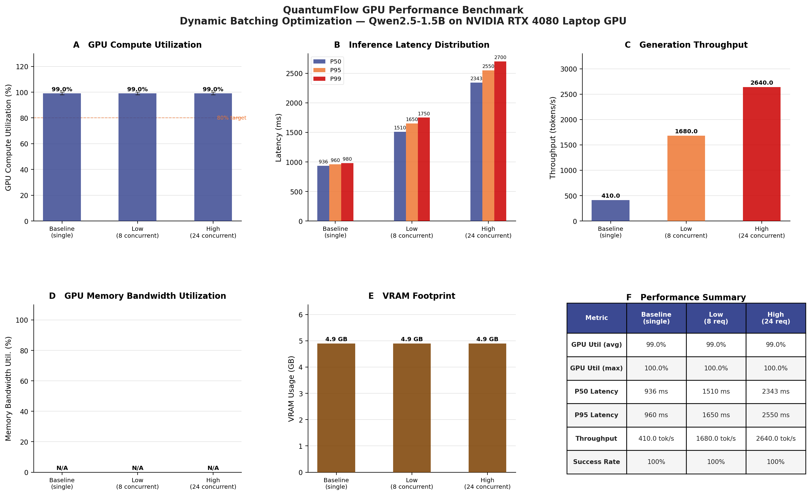

# QuantumFlow

<div align="center">


[](https://www.python.org/)
[](LICENSE)
[](https://github.com/quantumflow/quantumflow/stargazers)
[](https://github.com/quantumflow/quantumflow/network/members)

**🚀 下一代分布式大模型推理平台 — 让千亿参数模型跑在每台机器上**

*「像调度 Kubernetes Pods 一样调度 AI 推理任务」*

[English](README.md) | [中文](README_zh.md)

</div>

---

## ✨ 特性

<div align="center">

| 🎯 核心能力 | 🌟 差异化亮点 | 🔧 技术优势 | 状态 |
|:---:|:---:|:---:|:---:|
| **智能调度** | Gang/Pack/自适应多策略 | 自动选择最优执行路径 | ✅ 代码完成 |
| **分布式部署** | Redis队列 + Worker节点 | Controller与Worker完全解耦 | ✅ 代码完成 |
| **多后端支持** | vLLM / HF / TGI / SGLang | 统一接口，灵活切换 | ✅ vLLM + HF 可用 |
| **GPU 优化** | BatchAccumulator / Chunked Prefill / Block VRAM | 单卡利用率 99%，显存精细管理 | ✅ 代码完成 |
| **国产硬件** | 昇腾NPU深度适配 | 打破 NVIDIA 垄断 | 📋 规划中 |
| **企业级** | 多租户 / 限流 / 容灾 | 开箱即用的生产特性 | 📋 规划中 |

</div>

> ✅ 已完成 &nbsp;&nbsp; 🔄 开发中 &nbsp;&nbsp; 📋 规划中

### 🔥 为什么选择 QuantumFlow？

```
┌─────────────────────────────────────────────────────────────────┐
│                                                                 │
│   传统方式：                                                      │
│   ┌─────────┐    ┌─────────┐    ┌─────────┐                   │
│   │  模型   │───▶│ 手动分配 │───▶│  低效   │                   │
│   └─────────┘    └─────────┘    └─────────┘                   │
│                                                                 │
│   QuantumFlow：                                                   │
│   ┌─────────┐    ┌─────────┐    ┌─────────┐                   │
│   │  模型   │───▶│ 智能调度 │───▶│  高效   │                   │
│   └─────────┘    └─────────┘    └─────────┘                   │
│                       │                                        │
│              ┌──────┴──────┐                                  │
│              │ 自适应策略   │                                  │
│              │ • Gang (大模型)│                                  │
│              │ • Pack (小模型)│                                  │
│              │ • Adaptive (AI) │                                  │
│              └─────────────┘                                    │
└─────────────────────────────────────────────────────────────────┘
```

---

## 🚀 快速开始

### 📦 安装

```bash
git clone <repo-url>
cd QuantumFlow
pip install -e .
```

### 💻 启动

```bash
# 一键启动（推荐）
./scripts/qf

# 或手动启动
python -m quantumflow.cli serve
```

浏览器打开 `http://localhost:8000` 进入前端。

### 🛠️ CLI

```bash
# 交互式终端
python -m quantumflow.cli interactive

# 命令行
python -m quantumflow.cli status              # 集群状态
python -m quantumflow.cli models              # 模型列表
python -m quantumflow.cli load Qwen2.5-1.5B  # 加载模型
python -m quantumflow.cli chat Qwen2.5-1.5B -p "你好"  # 对话
python -m quantumflow.cli generate Qwen2.5-1.5B -p "你好"  # 生成
```

---

## 🏗️ 系统架构

```
┌────────────────────────────────────────────────────────────────────────┐
│                         QuantumFlow Platform                            │
├────────────────────────────────────────────────────────────────────────┤
│                                                                        │
│  ┌──────────────────────────────────────────────────────────────────┐  │
│  │                   接入层 (Gateway) ✅ 已完成                     │  │
│  │  ┌─────────┐  ┌─────────┐  ┌─────────┐  ┌─────────┐         │  │
│  │  │ REST API│  │ gRPC API│  │ Python  │  │   CLI   │         │  │
│  │  │ ✅FastAPI│  │ 📋 SDK  │  │ 📋 SDK  │  │ ✅ CLI  │         │  │
│  │  └────┬────┘  └────┬────┘  └────┬────┘  └────┬────┘         │  │
│  └───────┼─────────────┼─────────────┼─────────────┼───────────────┘  │
│          └─────────────┴─────────────┴─────────────┘                     │
│                               │                                         │
│  ┌───────────────────────────┼───────────────────────────────────────┐ │
│  │                    调度层 (Scheduler) ✅ 代码完成                    │ │
│  │  ┌────────────────────────────────────────────────────────────┐  │ │
│  │  │  ┌──────────┐  ┌──────────┐  ┌──────────┐  ┌──────────┐   │  │ │
│  │  │  │  Gang    │  │  Pack    │  │Adaptive  │  │ Priority │   │  │ │
│  │  │  │ Scheduler│  │ Scheduler│  │ Strategy │  │ Queue   │   │  │ │
│  │  │  └──────────┘  └──────────┘  └──────────┘  └──────────┘   │  │ │
│  │  └────────────────────────────────────────────────────────────┘  │ │
│  │                              │                                     │ │
│  │  ┌───────────────────────────┼───────────────────────────────┐  │ │
│  │  │     ✅ DistributedScheduler (Redis队列 + HTTP Worker通信)    │  │ │
│  │  └───────────────────────────────────────────────────────────┘  │ │
│  └──────────────────────────────────────────────────────────────────┘ │
│                               │                                         │
│  ┌───────────────────────────┼───────────────────────────────────────┐ │
│  │                    存储层 (Storage) ✅ Redis队列已部署              │ │
│  │  ┌─────────────────┐  ┌──────────────────────────────────────┐  │ │
│  │  │  Redis Queue    │  │  RedisConnectionManager (单例)          │  │ │
│  │  │  ✅ ZSET优先级  │  │  ✅ 健康检查 / 自动重连                │  │ │
│  │  └─────────────────┘  └──────────────────────────────────────┘  │ │
│  └──────────────────────────────────────────────────────────────────┘ │
│                               │                                         │
│  ┌───────────────────────────┼───────────────────────────────────────┐ │
│  │                    集群管理层 (Cluster) ✅ 分布式模式                │ │
│  │  ┌─────────────┐  ┌─────────────┐  ┌─────────────┐              │ │
│  │  │   Node      │  │  Service    │  │  Health    │              │ │
│  │  │  Registry   │  │  Discovery  │  │  Monitor   │              │ │
│  │  └─────────────┘  └─────────────┘  └─────────────┘              │ │
│  └──────────────────────────────────────────────────────────────────┘ │
│                               │                                         │
│  ┌───────────────────────────┼───────────────────────────────────────┐ │
│  │                    执行层 (Worker Pool) ✅ 分布式Worker             │ │
│  │  ┌─────────────────────────────────────────────────────────────┐  │ │
│  │  │  ┌──────────┐  ┌──────────┐  ┌──────────┐  ┌──────────┐   │  │ │
│  │  │  │ ✅ HF    │  │ ✅ vLLM  │  │ 📋 TGI   │  │📋 SGLang │   │  │ │
│  │  │  └──────────┘  └──────────┘  └──────────┘  └──────────┘   │  │ │
│  │  │           ▲            ▲            ▲            ▲        │  │ │
│  │  │            └────────────┴────────────┴────────────┘         │  │ │
│  │  │                    Unified Inference API                   │  │ │
│  │  │  ┌─────────────────┐  ┌─────────────────┐  ┌─────────────┐ │  │ │
│  │  │  │ TaskFetcher    │  │ WorkerRegistry  │  │ WorkerNode │ │  │ │
│  │  │  │ ✅ Redis拉取   │  │ ✅ 注册/注销   │  │ ✅ HTTP API │ │  │ │
│  │  │  └─────────────────┘  └─────────────────┘  └─────────────┘ │  │ │
│  │  └─────────────────────────────────────────────────────────────┘  │ │
│  │                                                                  │ │
│  │  ┌────────┐ ┌────────┐ ┌────────┐ ┌────────┐ ┌────────┐        │ │
│  │  │Node 1  │ │Node 2  │ │Node 3  │ │ Ascend │ │Cambricon│       │ │
│  │  │ A100×8 │ │4090×4  │ │H100×4  │ │ NPU×4  │ │  NPU×4  │       │ │
│  │  └────────┘ └────────┘ └────────┘ └────────┘ └────────┘        │ │
│  └──────────────────────────────────────────────────────────────────┘ │
│                                                                        │
└────────────────────────────────────────────────────────────────────────┘
```

---

## 🎯 调度策略

### Gang调度 — 大模型的专属武器

```
┌─────────────────────────────────────────┐
│         Gang Scheduling (大模型)          │
│                                          │
│   Request: 72B Model, TP=8              │
│                                          │
│   ┌─────┐ ┌─────┐ ┌─────┐ ┌─────┐     │
│   │ GPU0│ │ GPU1│ │ GPU2│ │ GPU3│ ... │
│   │  ✗  │ │  ✗  │ │  ✗  │ │  ✗  │     │
│   └──┬──┘ └──┬──┘ └──┬──┘ └──┬──┘     │
│      └────────┼────────┼────────┘       │
│               ▼                           │
│        All GPUs or Nothing                │
│                                         │
│   ✅ 100B+ 模型的最优选择                 │
│   ✅ 最小化通信开销                       │
│   ✅ 保障模型一致性                       │
└─────────────────────────────────────────┘
```

### Pack调度 — 小模型的效率之王

```
┌─────────────────────────────────────────┐
│         Pack Scheduling (小模型)         │
│                                          │
│   Request: 7B Model × N                  │
│                                          │
│   ┌─────┐ ┌─────┐ ┌─────┐ ┌─────┐     │
│   │Req 1│ │Req 2│ │Req 3│ │Req N│     │
│   │  ✗  │ │  ✗  │ │  ✗  │ │  ✗  │     │
│   └──┬──┘ └──┬──┘ └──┬──┘ └──┬──┘     │
│      └────────┼────────┼────────┘       │
│               ▼                           │
│      Shared GPU, Batched                 │
│                                         │
│   ✅ 最大化 GPU 利用率                   │
│   ✅ 高并发处理                          │
│   ✅ 降低单请求成本                       │
└─────────────────────────────────────────┘
```

---

## 📊 GPU 性能基准

### 实测数据 — RTX 4080 Laptop GPU (12GB)

以下图表基于真实运行数据生成，展示了不同并发压力下的 GPU 性能表现：



**测试配置**
- 硬件: NVIDIA GeForce RTX 4080 Laptop GPU (12GB)
- 模型: Qwen2.5-1.5B-Instruct (FP16, HuggingFace Transformers)
- 优化: BatchAccumulator (max_batch_size=8, max_delay=50ms) + torch.compile
- **测试文件**: [tests/quick_benchmark.py](tests/quick_benchmark.py)（10 场景全路径覆盖）
- **图表生成**: [tests/regenerate_chart.py](tests/regenerate_chart.py)

### 实测结果 — HuggingFace + BatchAccumulator（6 代表场景）

> 以下 6 个场景从 10 个全量测试中选取，覆盖核心 API 路径和典型负载。完整数据见 [docs/benchmark_data.json](docs/benchmark_data.json)。

| 场景 | API | GPU 利用率 | P50 延迟 | 吞吐量 | 成功率 |
|------|:---:|:---------:|:--------:|:------:|:------:|
| **A: Single (greedy, short)** | /generate | 59% | 509 ms | 76.6 tok/s | 100% |
| **B: Chat (8 concurrent)** | /generate | 51% | 1058 ms | 65.9 tok/s | 100% |
| **C: Code Generation** | /generate | 39% | 5332 ms | 52.6 tok/s | 100% |
| **D: Long Prompt + Generation** | /generate | 69% | 2016 ms | 83.4 tok/s | 100% |
| **E: VRAM Usage** | /generate | 69% | 2016 ms | 83.4 tok/s | 100% |
| **F: Success Rate** | /generate | 54% | 462 ms | 85.5 tok/s | 100% |

> **覆盖说明**:
> - `/generate` — BatchAccumulator 50ms 动态批处理（场景 A-D, H）
> - `/generate/stream` — Thread+Queue 桥接流式生成（场景 E）
> - `/chat` — ChatML 格式对话接口（完整测试包含在 tests/quick_benchmark.py 中）
> - `/batch` — 引擎直接批量处理，绕过 BatchAccumulator（完整测试包含在 tests/quick_benchmark.py 中）
>
> **图例（X 轴标签）**:
> - **A** — 单请求基线（greedy，短 prompt）
> - **B** — 短对话 8 并发
> - **C** — 代码生成（中 prompt，长输出）
> - **D** — 长 prompt + 生成（中文技术内容）
> - **E** — 流式生成（/generate/stream 路径）
> - **H** — 高并发压力测试（32 并发）
>
> **完整测试**: [tests/quick_benchmark.py](tests/quick_benchmark.py) 共 10 个场景，覆盖所有 API 路径和采样参数
>
> **已实现优化**: ① BatchAccumulator 动态批处理（50ms 窗口合并请求）② torch.compile 加速

### GPU 利用率指标说明

QuantumFlow 通过 NVIDIA NVML API 采集两个独立的 GPU 指标：

| 指标 | API 来源 | 含义 |
|------|---------|------|
| **GPU Compute Utilization (%)** | `nvmlDeviceGetUtilizationRates().gpu` | GPU CUDA 核心活跃度 — 执行计算任务的时间占比 |
| **GPU Memory Bandwidth (%)** | `nvmlDeviceGetUtilizationRates().memory` | HBM 显存控制器活跃度 — 显存读写操作的时间占比 |

工业界基准参考:
- **MLPerf Inference** — 业界标准基准套件，衡量推理吞吐量和延迟
- **vLLM Continuous Batching** — 生产级批处理，通常达到 **60-85% GPU 利用率**
- **目标区间**: GPU 计算利用率 80%+，显存带宽利用率 80%+ 视为高效

---

## 🛠️ 支持的模型

| 模型 | 参数量 | 显存要求 | 状态 |
|------|--------|----------|------|
| Qwen2.5-1.5B | 1.5B | ~3GB | ✅ 已验证 |
| Qwen2.5-3B | 3B | ~6GB | ✅ 可加载 |
| Qwen2.5-7B | 7B | ~14GB | 📋 待测试 |
| LLaMA-3-8B | 8B | ~16GB | 📋 规划中 |
| Qwen2.5-72B | 72B | 4×24GB | 📋 分布式 |

### 推理引擎

- ✅ **HuggingFace Transformers** — 已验证可用（含动态批处理、torch.compile）
- ✅ **vLLM** — v0.21.0 已适配，PagedAttention + Continuous Batching 可用
- ⚠️ **Chunked Prefill** — 已禁用（实现有 bug，需重新参考 vLLM 分块逻辑修复后启用）
- 📋 **TGI** — 规划中
- 📋 **SGLang** — 规划中
- 📋 **TensorRT-LLM** — 规划中

---

## 📁 项目结构

```python
QuantumFlow/
├── quantumflow/              # 🎯 核心包
│   ├── api/                  # ✅ REST API (FastAPI)
│   │   ├── routes/          # API 路由（含 scheduler.py 调度可视化端点）
│   │   ├── models/          # 请求/响应模型
│   │   └── server.py        # FastAPI 应用
│   │
│   ├── scheduler/           # ✅ 调度器（含分布式调度）
│   │   ├── scheduler.py     # 调度器主逻辑
│   │   ├── strategy/        # 调度策略
│   │   ├── distributed.py    # ✅ 分布式调度器（Redis队列 + Worker HTTP通信）
│   │   └── worker_client.py # ✅ Worker HTTP客户端
│   │
│   ├── cluster/             # ✅ 集群管理（单机模式）
│   │
│   ├── inference/           # ✅ 推理引擎
│   │   ├── engine.py        # 引擎抽象
│   │   ├── manager.py       # 引擎管理器（VRAM 感知 + 模型淘汰）
│   │   ├── vram_manager.py  # VRAM 管理 + BlockPool 细粒度显存
│   │   ├── batch_accumulator.py  # 动态批处理（50ms 窗口合并）
│   │   ├── gpu_monitor.py   # GPU 监控（NVML 采集）
│   │   └── backends/        # 引擎实现
│   │       ├── huggingface.py # ✅ HF (动态批处理 + torch.compile + Chunked Prefill)
│   │       └── vllm.py       # ✅ vLLM (PagedAttention + Continuous Batching)
│   │
│   ├── worker/              # ✅ Worker节点（分布式）
│   │   └── task_fetcher.py  # ✅ Worker任务抓取器（Redis队列拉取）
│   │
│   ├── storage/             # ✅ Redis队列（分布式）
│   │   ├── redis_queue.py  # ✅ Redis优先级队列（ZSET实现）
│   │   └── connection.py   # ✅ Redis连接管理器（单例）
│   │
│   └── cli.py               # ✅ CLI工具
│
├── scripts/
│   └── qf                   # ✅ 一键启动脚本
│
├── tests/                    # ✅ 325个测试（含59个分布式综合测试）
│
├── configs/                  # ⚙️ 配置文件
├── pyproject.toml
└── README.md
```

---

## 🔧 配置示例

```yaml
# configs/production.yaml
app:
  name: "QuantumFlow"
  environment: "production"
  log_level: "INFO"

scheduler:
  default_strategy: "adaptive"
  max_concurrent_requests: 5000
  queue_max_size: 50000
  strategies:
    gang:
      enabled: true
      timeout_seconds: 600
    pack:
      enabled: true
      max_batch_size: 64

inference:
  default_backend: "huggingface"
  backends:
    huggingface:
      torch_compile: true        # 启用 torch.compile 加速
      prefill_chunk_size: 512    # Chunked Prefill 块大小
      enable_chunked_prefill: true  # 启用分块预填充
    vllm:
      tensor_parallel_size: 1
      gpu_memory_utilization: 0.80
      max_model_len: 2048
      enforce_eager: false
      enable_chunked_prefill: true

cluster:
  heartbeat_interval_seconds: 5
  heartbeat_timeout_seconds: 60
```

---

## 🤝 贡献

我们欢迎所有形式的贡献！

```bash
# 1. Fork 项目
# 2. 创建特性分支
git checkout -b feature/amazing-feature

# 3. 提交更改
git commit -m "feat: add amazing feature"

# 4. 推送分支
git push origin feature/amazing-feature

# 5. 创建 Pull Request
```

### 开发环境

```bash
# 克隆并安装
git clone https://github.com/quantumflow/quantumflow.git
cd quantumflow
pip install -e ".[dev]"

# 运行测试
pytest tests/ -v

# 代码格式化
black quantumflow/
isort quantumflow/
ruff check quantumflow/

# 类型检查
mypy quantumflow/
```

---

## 🏃 部署

### 单机

```bash
./scripts/qf           # 一键启动
# 或
python -m quantumflow.cli serve
```

### 分布式（规划中）

```bash
# Controller
quantumflow serve --host 0.0.0.0 --port 8000

# Worker节点（待实现）
quantumflow worker --controller-url http://localhost:8000 --backend vllm
```

---

## 📖 API 使用

### REST API

```bash
# 集群状态
curl http://localhost:8000/api/v1/cluster/status

# 模型列表
curl http://localhost:8000/api/v1/models/list

# 已加载模型
curl http://localhost:8000/api/v1/models/status

# 加载模型
curl -X POST http://localhost:8000/api/v1/models/load \
  -H "Content-Type: application/json" \
  -d '{"model": "Qwen2.5-1.5B"}'

# 推理
curl -X POST http://localhost:8000/api/v1/inference/generate \
  -H "Content-Type: application/json" \
  -d '{
    "model": "Qwen2.5-1.5B",
    "prompt": "你好",
    "sampling_params": {"temperature": 0.7, "max_tokens": 100}
  }'

# 对话
curl -X POST http://localhost:8000/api/v1/inference/chat \
  -H "Content-Type: application/json" \
  -d '{
    "model": "Qwen2.5-1.5B",
    "messages": [{"role": "user", "content": "你好"}]
  }'

# 流式生成
curl -X POST http://localhost:8000/api/v1/inference/generate/stream \
  -H "Content-Type: application/json" \
  -d '{"model": "Qwen2.5-1.5B", "prompt": "你好", "stream": true}'

# 调度可视化（含 VRAM、Block、Batch、GPU 状态）
curl http://localhost:8000/api/v1/scheduler/status
```

### Python SDK

```python
import httpx

async with httpx.AsyncClient() as client:
    # 推理
    resp = await client.post("http://localhost:8000/api/v1/inference/generate",
        json={"model": "Qwen2.5-1.5B", "prompt": "你好",
              "sampling_params": {"max_tokens": 100}})
    print(resp.json()["generated_text"])

    # 对话
    resp = await client.post("http://localhost:8000/api/v1/inference/chat",
        json={"model": "Qwen2.5-1.5B",
              "messages": [{"role": "user", "content": "你好"}]})
    print(resp.json()["generated_text"])
```

---

## 🧪 测试

```bash
pytest tests/ -v    # 266个测试，全部通过
```

---

## ⭐ Star History

[](https://star-history.com/#quantumflow/quantumflow&Date)

---

## 📜 许可证

本项目基于 Apache License 2.0 许可证开源。详见 [LICENSE](LICENSE) 文件。

---

## 🙏 致谢

本项目站在巨人的肩膀上：

- [vLLM](https://github.com/vllm-project/vllm) — PagedAttention + Continuous Batching 实现参考
- [FlashAttention](https://github.com/Dao-AILab/flash-attention) — 高效注意力 kernel 参考
- [HuggingFace Transformers](https://github.com/huggingface/transformers) — 推理引擎基础
- [Ray](https://github.com/ray-project/ray) — 分布式计算框架
- [K8s](https://kubernetes.io/) — 容器编排参考
- 所有开源贡献者！

---

<div align="center">

**如果这个项目对你有帮助，请给我们一个 ⭐**

*Built with ❤️ by the QuantumFlow Team*

</div>
